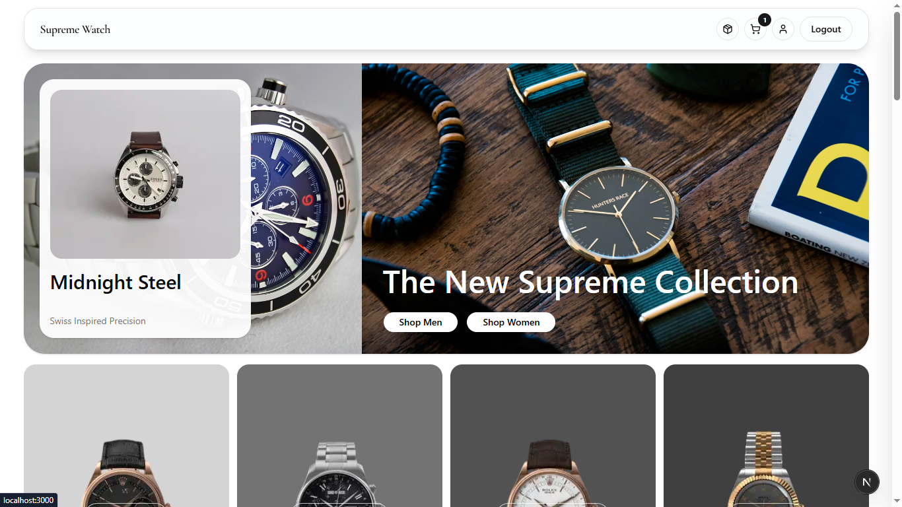

# 🛒 Supreme Watch – Real-Time E-Commerce (Next.js + Supabase)



## 🚀 Overview

Supreme Watch adalah aplikasi **full-stack e-commerce** dengan fitur **real-time inventory & order updates** serta **payment gateway integration**.

Project ini dirancang sebagai **portfolio piece dalam 5 hari** untuk menunjukkan kemampuan membangun aplikasi production-ready dengan kompleksitas nyata (bukan sekadar CRUD).

---

## 🎯 Goals

### Product Goals

- Membuat mini e-commerce dengan:
  - Real-time stock updates
  - Real-time order tracking
  - Secure payment integration

### User Goals

- Browse produk dengan update stok realtime
- Add to cart & checkout dengan mudah
- Pembayaran aman (Midtrans)
- Tracking status order secara realtime
- Admin dapat mengelola produk & order

### Success Metrics

- ⚡ Real-time update tanpa refresh
- 💳 Payment success rate > 95%
- ⏱️ Checkout < 2 menit
- 🚀 Page load < 2 detik

---

## 💼 Business Objectives

- Showcase **Full-Stack Skills**
- Demonstrate **Real-Time Systems**
- Implement **Production Payment Flow**
- Build **Portfolio Differentiator**

### Why This Project Matters?

- E-commerce = kompleks (state, transaksi, async flow)
- Payment gateway = real-world skill
- Real-time = advanced engineering value
- Highly attractive for recruiters

---

## 🧩 Tech Stack

### Frontend

- Next.js (App Router)
- Tailwind CSS + shadcn/ui
- Zustand (state management)
- React Hook Form + Zod

### Backend & Realtime

- Supabase (PostgreSQL)
- Supabase Realtime (WebSocket)
- Supabase Auth
- Supabase Storage

### Payment

- Midtrans (sandbox)

### Additional

- Resend (email notifications)
- Vercel (deployment)

---

## 🎨 Design Inspiration

- All Birds → Minimalis design

---

## 🎯 Features

### 👤 Customer

- Authentication (login/register)
- Browse & search products
- Product detail + real-time stock
- Shopping cart (persisted)
- Checkout + payment integration
- Order tracking (real-time)
- Email notification

### 🛠️ Admin

- Dashboard (orders, revenue, stock)
- CRUD products + image upload
- Manage orders & update status
- Low stock alert (via email)

### ⚙️ Technical

- Real-time stock updates
- Real-time order status
- Payment webhook handling
- Mobile responsive
- Production deployment

---

## ⚡ Critical Highlights

- 🔥 Real-time synchronization (WebSocket)
- 💳 Payment gateway integration
- 📦 Full e-commerce flow
- 🚀 Production-ready architecture

---

## 🛠️ Setup

```bash
git clone https://github.com/fakhri-muzakki/supreme-watch.git
cd supreme-watch
npm install
```

### Environment Variables

```env
NEXT_PUBLIC_BASE_URL=http://localhost:3000
NODE_ENV="development"
ADMIN_EMAIL=youremail@gmail.com
# DATABASE_URL=

# Supabase
NEXT_PUBLIC_SUPABASE_URL=
NEXT_PUBLIC_SUPABASE_ANON_KEY=

# Midtrans
MIDTRANS_APP_URL="https://app.sandbox.midtrans.com"
MIDTRANS_API_URL="https://api.sandbox.midtrans.com"

MIDTRANS_SERVER_KEY=
NEXT_PUBLIC_MIDTRANS_CLIENT_KEY=
MIDTRANS_IS_PRODUCTION=false

# Resend
RESEND_API_KEY=
EMAIL_FROM=Supreme Watch <onboarding@resend.dev>
# EMAIL_FROM=Supreme Watch <fakhrimuzakki119@gmail.com>
```

### Run

```bash
npm run dev
```

---

## 🚀 Deployment

Deploy ke:

- Vercel (Frontend)
- Supabase (Backend)
- Midtrans (Sandbox)

---

## 📌 Portfolio Description

> Full-stack e-commerce with real-time inventory updates, secure payment integration (Midtrans), and admin dashboard. Built in 5 days using Next.js & Supabase.

---

## 🙌 Author

Fakhri Muzakki
